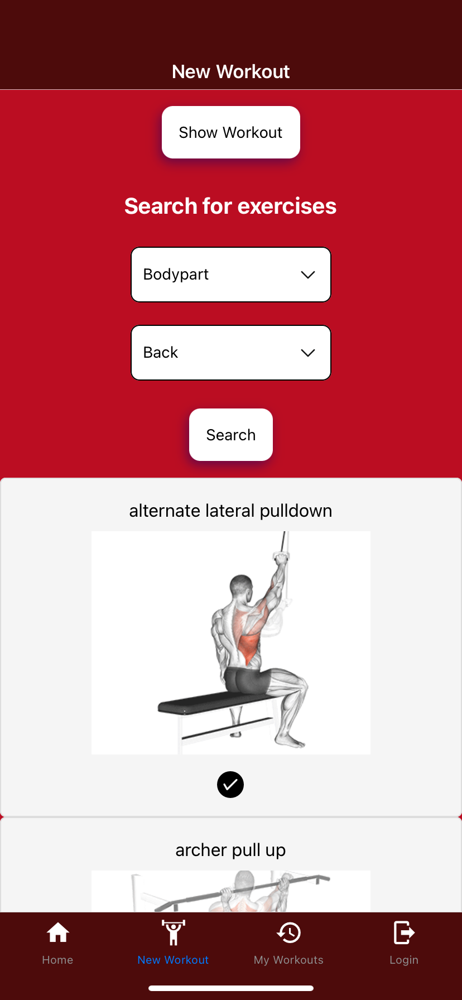
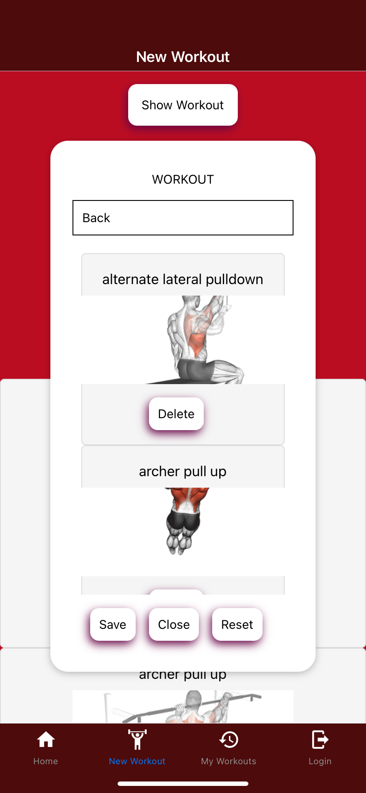
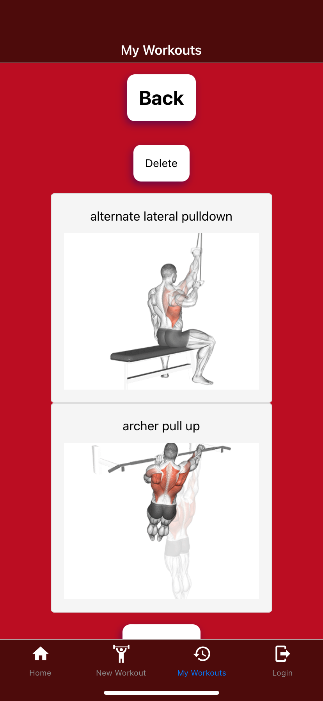

# WRKout

WRKout is a mobile app built using React Native and [exerciseDB](https://rapidapi.com/justin-WFnsXH_t6/api/exercisedb/)
 to help gym goers and people wanting to workout find exercises and movements that they like.

## Technologies

- React-Native
- Firebase
- React-Native components such as dropdown-picker and RNModal

## Usage
Make sure you have React-native installed and Expo on your computer and Expo-Go in your mobile app

1. Clone the repository
   ---
   `git clone https://github.com/AkseliVa/WRKout.git`

2. Navigate to your project directory 
   ---
   `cd your-project-directory`

4. Open the project in your code editor
   ---
   `code .`

5. Install dependencies
   ---
   `npm install`

6. Start the project using Expo
   ---
   `npx expo start`

You can search for movements in the "New Workout"-page

Add them to your database by pressing the "Show Workout"-button and pressing "Save"

And view them in the "My Workouts"-page

